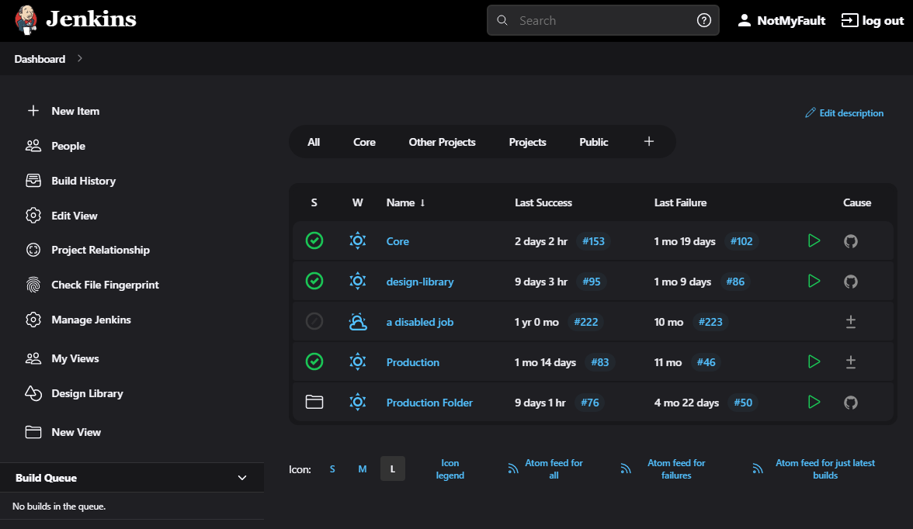
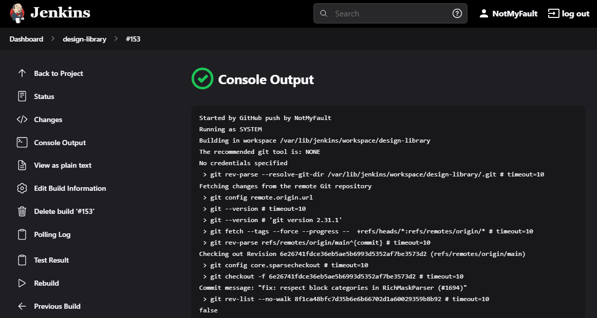

# Dark Theme for Jenkins (Incubated project)

[](https://gitter.im/jenkinsci/hackfest?utm_source=badge&utm_medium=badge&utm_campaign=pr-badge)

This repository contains a new dark theme for Jenkins which is currently **under development**.
It requires changes in the Jenkins core, and it is not ready for production use.
Visualization is also not perfect, contributions are welcome!

## Usage

The theme is designed to be used with the [Simple Theme Plugin](https://plugins.jenkins.io/simple-theme-plugin/).
See the plugin documentation for theme installation guidelines.

## Screenshots

Main screen:



Build console:



## References

* Introduction and first demo at the Jenkins UI/UX hackfest:
  [video](https://youtu.be/hJuAO09rKLM?t=1357),
  [slides](https://docs.google.com/presentation/d/19N4B7BXu_Zfw8IDdUAZl_83-jXDAvwWC2KI6BvvNUCI/edit#slide=id.g8790db40db_0_205)
* Integration pull request with the changes:
  [jenkinsci/jenkins#4752](https://github.com/jenkinsci/jenkins/pull/4752)

## Contributing

We will appreciate testing of the theme and any contributions to the theme.

### Quick start

We have a demo with a pre-configured Docker image you can use for trying out the Dark theme.
You can find it [here](./demo/README.md).

### Manual setup

1. Run Jenkins from a pull request
  *  ```docker run --rm -ti -p 8080:8080 -e ID=4752 jenkins/core-pr-tester```
2. Install the Simple Theme Plugin
3. Add the theme CSS from this repository to the instance
  * You can use the jsdeliver CDN to pull it directly from GitHub: https://cdn.jsdelivr.net/gh/jenkinsci/dark-theme@master/theme.css

More detailed testing guidelines are coming soon!

### Development

The pre-configured Docker image can be also used for development purposes.
You can find the guide [here](./demo/README.md#development).

## References

* The theme was created as a part of the [Jenkins UI/UX Hackfest](https://github.com/jenkinsci/ui-ux-hackfest-2020) on May 25-29, 2020.
* The theme is inspired by the [camalot/jenkins-dark-stylish](https://github.com/camalot/jenkins-dark-stylish) theme, but it is a new theme created by scratch.
